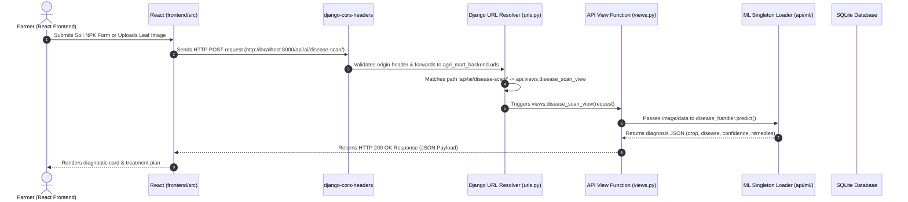

# 🌾 Agri-MART Django Backend Guide for Beginners

Welcome to the backend documentation for **Agri-MART**! This guide is created to help you understand how Django works, how the project is structured, and how HTTP requests flow through Django into Machine Learning models to return responses to the React frontend.

---

## 📚 Table of Contents
1. [Core Django Concepts Explained](#1-core-django-concepts-explained)
2. [Folder & Directory Structure](#2-folder--directory-structure)
3. [The Complete Request-Response Workflow](#3-the-complete-request-response-workflow)
4. [How ML Models Are Loaded (Singleton Pattern)](#4-how-ml-models-are-loaded-singleton-pattern)
5. [API Endpoints & Payload Guide](#5-api-endpoints--payload-guide)
6. [How to Run & Debug the Django Backend](#6-how-to-run--debug-the-django-backend)

---

## 1. Core Django Concepts Explained

Django follows an **MVT (Model-View-Template)** architecture, but when building an **API Backend with Django REST Framework (DRF)**, it behaves as **Model-Serializer-View**:

| Django Component | What It Does | Analogy |
|---|---|---|
| **`manage.py`** | Command-line utility to run server, migrate DB, create apps | The control panel / ignition |
| **`settings.py`** | Project configuration (database, CORS, INSTALLED_APPS, Media) | The master configuration control room |
| **`urls.py`** | Routes incoming URL paths (`/api/ai/disease-scan/`) to Python functions | The traffic dispatcher / GPS router |
| **`views.py`** | Takes HTTP requests, runs logic/ML models, and returns HTTP responses | The kitchen chef preparing the order |
| **`models.py`** | Defines database tables using Python classes | The database architect |
| **`serializers.py`** | Converts Django objects into JSON (and vice-versa) | The translator between Python and Web JSON |

---

## 2. Folder & Directory Structure

```
backend/
├── agri_mart_backend/          # ⚙️ Master Project Configuration Folder
│   ├── __init__.py
│   ├── settings.py             # App configurations, CORS, ML paths
│   ├── urls.py                 # Root URL router (routes /api/ to api.urls)
│   ├── wsgi.py                 # Web Server Gateway Interface for deployment
│   └── asgi.py                 # Asynchronous Server Gateway Interface
│
├── api/                        # 🚀 Agri-MART API Application Folder
│   ├── ml/                     # 🧠 Machine Learning Model Loaders & Preprocessors
│   │   ├── disease_loader.py   # Handles CNN leaf image preprocessing & inference
│   │   ├── recommendation_loader.py # Handles NPK soil classifier prediction
│   │   └── yield_loader.py     # Handles crop harvest yield regressor
│   │
│   ├── views.py                # 📩 API logic for login, registration, disease, yield, market
│   ├── urls.py                 # 🗺️ Sub-routes (/auth/login/, /ai/disease-scan/, etc.)
│   ├── models.py               # 🗄️ Database schemas for users and scan logs
│   ├── apps.py                 # App configuration metadata
│   └── tests.py                # Unit tests
│
├── ml_models/                  # 💾 Drop your trained ML models here (.pth, .h5, .pkl, .onnx)
│   └── README.md               # Model format documentation & placement guide
│
├── media/                      # 🖼️ Uploaded crop foliage images stored here
├── venv/                       # 🐍 Isolated Python Virtual Environment
├── db.sqlite3                  # 📦 SQLite database file
├── manage.py                   # 🛠️ Django CLI tool
└── BACKEND_GUIDE.md            # 📖 This documentation file
```

---

## 3. The Complete Request-Response Workflow

Here is exactly what happens when a user clicks **"Run AI Diagnostic Scan"** or **"Generate Crop Matches"** on the React frontend:



### Step-by-Step Explanation of Code Execution:

1. **HTTP Request Arrives**: The React app sends a `POST` request to `http://localhost:8000/api/ai/disease-scan/`.
2. **CORS Middleware**: `corsheaders.middleware.CorsMiddleware` in `settings.py` checks if the React domain `http://localhost:5173` is allowed (Returns CORS headers).
3. **Root URL Resolution (`agri_mart_backend/urls.py`)**:
   ```python
   path('api/', include('api.urls'))  # Redirects all /api/ requests to api/urls.py
   ```
4. **App URL Resolution (`api/urls.py`)**:
   ```python
   path('ai/disease-scan/', views.disease_scan_view, name='disease_scan')
   ```
5. **View Execution (`api/views.py`)**:
   ```python
   @api_view(['POST'])
   def disease_scan_view(request):
       image_file = request.FILES.get('image')
       result = disease_handler.predict(image_file)
       return Response(result)
   ```
6. **Inference Execution (`api/ml/disease_loader.py`)**: The image is resized to `(224, 224)`, converted to a NumPy array, passed into the model, and structured JSON results are generated.
7. **HTTP Response Delivered**: The `Response(result)` returns JSON data back to React.

---

## 4. How ML Models Are Loaded (Singleton Pattern)

Loading large Machine Learning models (like a 100MB PyTorch `.pth` CNN or Scikit-Learn `.pkl` model) directly inside a view function is **bad practice** because it would re-read the model file from hard disk on every single HTTP request, slowing response times from 50ms to 5 seconds.

### The Singleton Pattern Solution:
In `backend/api/ml/disease_loader.py`, `recommendation_loader.py`, and `yield_loader.py`, we use the **Python Singleton Pattern**:

```python
class DiseaseModelHandler:
    _instance = None

    def __new__(cls):
        if cls._instance is None:
            cls._instance = super().__new__(cls)
            cls._instance._load_model() # Loaded ONLY ONCE into RAM!
        return cls._instance

    def _load_model(self):
        # Checks backend/ml_models/ for trained model files
        pass

disease_handler = DiseaseModelHandler()  # Instantiated once when Django boots up!
```

**Key Benefit**: When Django starts, the models load into CPU/GPU RAM **once**. When API requests come in, predictions happen instantly in milliseconds!

---

## 5. API Endpoints & Payload Guide

### 1. Auth: Sign In
- **URL**: `/api/auth/login/`
- **Method**: `POST`
- **Request Body (JSON)**:
  ```json
  {
    "email": "farmer.ramesh@agrimart.com",
    "password": "Harvest2026!"
  }
  ```
- **Response (JSON)**:
  ```json
  {
    "message": "Welcome back, farmer.ramesh!",
    "user": {
      "email": "farmer.ramesh@agrimart.com",
      "fullname": "Farmer Ramesh",
      "role": "farmer",
      "token": "agrimart_django_jwt_token_simulation"
    }
  }
  ```

---

### 2. Auth: Register
- **URL**: `/api/auth/register/`
- **Method**: `POST`
- **Request Body (JSON)**:
  ```json
  {
    "fullname": "Ramesh Patel",
    "email": "ramesh@agrimart.com",
    "phone": "+91 98765 43210",
    "role": "farmer"
  }
  ```
- **Response (JSON)**:
  ```json
  {
    "message": "Account registered successfully for Ramesh Patel!",
    "user": {
      "fullname": "Ramesh Patel",
      "email": "ramesh@agrimart.com",
      "role": "farmer",
      "token": "agrimart_django_jwt_token_simulation"
    }
  }
  ```

---

### 3. AI: Leaf Disease Scan
- **URL**: `/api/ai/disease-scan/`
- **Method**: `POST`
- **Content-Type**: `multipart/form-data`
- **Form Fields**: `image`: `(file)`
- **Response (JSON)**:
  ```json
  {
    "crop": "Tomato (Solanum lycopersicum)",
    "disease": "Early Blight (Alternaria solani)",
    "confidence": "96.8%",
    "bar_width": "96.8%",
    "symptoms": "Dark brown concentric ring spots on lower foliage leading to chlorosis.",
    "treatments": [
      "Prune and destroy infected bottom foliage.",
      "Apply Mancozeb 75 WP (2g/L) or Copper Oxychloride 50 WP (2.5g/L) spray.",
      "Transition irrigation to ground drip to prevent water splashing spores."
    ],
    "severity": "Moderate",
    "organic_alt": "Neem Oil 3%"
  }
  ```

---

### 4. AI: Crop Recommendation
- **URL**: `/api/ai/crop-recommendation/`
- **Method**: `POST`
- **Request Body (JSON)**:
  ```json
  {
    "N": 90,
    "P": 42,
    "K": 43,
    "ph": 6.5,
    "rainfall": 202,
    "temp": 26.5,
    "humidity": 82
  }
  ```
- **Response (JSON)**:
  ```json
  {
    "topCrop": {
      "emoji": "🌾",
      "title": "Rice (Paddy)",
      "match": "98.4%",
      "yield": "4.8 - 5.5 Tonnes / Acre",
      "desc": "High rainfall and adequate nitrogen create prime loamy conditions for rice."
    },
    "secondCrop": { "emoji": "🌽", "title": "Maize (Corn)", "match": "89.1%" },
    "thirdCrop": { "emoji": "🌱", "title": "Jute & Pulses", "match": "84.0%" }
  }
  ```

---

### 5. AI: Yield Prediction
- **URL**: `/api/ai/yield-prediction/`
- **Method**: `POST`
- **Request Body (JSON)**:
  ```json
  {
    "crop": "rice",
    "acres": 5,
    "season": "kharif",
    "irrigation": "drip",
    "fertilizer": "balanced"
  }
  ```
- **Response (JSON)**:
  ```json
  {
    "totalTonnes": "29.4",
    "yieldPerAcre": "5.88",
    "grossRevenue": "646,800",
    "mspPerQtl": 2200,
    "cropName": "Rice"
  }
  ```

---

### 6. AI: Plant Growth Tracker
- **URL**: `/api/ai/growth-tracker/`
- **Method**: `GET`
- **Response (JSON)**:
  ```json
  {
    "current_batch": "Wheat Field #3 (Planted 48 Days Ago)",
    "active_phase": "Phase 3: Tillering & Stem Extension",
    "ndvi_score": 0.78,
    "ndvi_rating": "Vibrant Green Canopy (Healthy)",
    "steps": [
      { "num": 1, "label": "Germination", "dates": "Days 1 - 10", "status": "completed" },
      { "num": 2, "label": "Seedling Emergence", "dates": "Days 11 - 28", "status": "completed" },
      { "num": 3, "label": "Tillering & Stemming", "dates": "Days 29 - 60 (Active - 80%)", "status": "current" }
    ]
  }
  ```

---

### 7. Market: Live Mandi Commodity Prices
- **URL**: `/api/market/prices/`
- **Method**: `GET`
- **Response (JSON)**:
  ```json
  {
    "rates": [
      {
        "commodity": "🌾 Wheat (Lokwan)",
        "mandi": "Kalyan APMC, Maharashtra",
        "arrivals": "1,240",
        "min": "2,280",
        "max": "2,540",
        "modal": "2,450",
        "forecast": "Bullish (+4%) 📈",
        "forecastClass": "bullish"
      }
    ]
  }
  ```

---

## 6. How to Run & Debug the Django Backend

### Option A: Running with Virtual Environment (Recommended)
1. Open PowerShell and navigate to `backend/`:
   ```powershell
   cd backend
   ```
2. Activate the virtual environment:
   ```powershell
   .\venv\Scripts\Activate.ps1
   ```
3. Run the development server:
   ```powershell
   python manage.py runserver 8000
   ```
4. Access API in browser or Postman: `http://localhost:8000/api/market/prices/`

### Option B: Applying Database Migrations (When modifying `models.py`)
```powershell
python manage.py makemigrations
python manage.py migrate
```

### Option C: Creating a Superuser Admin Account
```powershell
python manage.py createsuperuser
```
Access Django Admin interface at `http://localhost:8000/admin/`.

---

🎉 **Congratulations! You now have a complete understanding of your Django REST backend architecture!**
